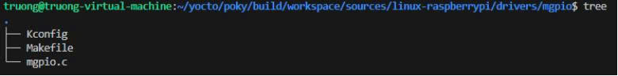

# Build a Raspberry Pi 3 Image with Yocto + Device Tree + Kernel Driver

This document (in **Markdown**) records the steps to add a simple **Linux kernel module** (`mgpio`) combined with a Device Tree node to drive an LED on **GPIO27** for Raspberry Pi 3, integrate it with the **Yocto Project**, package it as a **patch**, and rebuild the kernel/image.

> 💡 **Module vs Built-in**
>
> - **Module build**: use `tristate` and set `CONFIG_MGPIO=m`. You can load/unload with `modprobe`/`rmmod`. You may auto-load at boot via `KERNEL_MODULE_AUTOLOAD`.
> - **Built-in build**: change `tristate → bool` and set `CONFIG_MGPIO=y`. In this case, **remove** `KERNEL_MODULE_AUTOLOAD += "mgpio"` because it has no effect for built-ins.

---

## 1) Set up the Yocto environment

```bash
source oe-init-build-env
```

## 2) Extract kernel sources (devtool)

```bash
devtool modify virtual/kernel
```

After this command, the kernel sources are unpacked under:

```
workspace/sources/linux-raspberrypi/
```

## 3) Create the `mgpio` driver directory and files

Create the driver directory inside the kernel tree:

```bash
mkdir -p workspace/sources/linux-raspberrypi/drivers/mgpio
```

Inside `drivers/mgpio/`, create the files as shown:



### 3.1) `drivers/mgpio/Kconfig`

```kconfig
menu "mgpio device driver"
config MGPIO
    tristate "mgpio device driver"
    depends on ARM
    default m if ARM
    help
      Select this option to run the mgpio module.
endmenu
```

### 3.2) `drivers/mgpio/Makefile`

```make
EXTRA_CFLAGS = -Wall
obj-$(CONFIG_MGPIO) = mgpio.o
```

### 3.3) `drivers/mgpio/mgpio.c`

```c
#include <linux/module.h>
#include <linux/gpio/consumer.h>
#include <linux/platform_device.h>
#include <linux/of.h>

#define DRIVER_AUTHOR "Vo Truong"
#define DRIVER_DESC   "Raspberry Pi GPIO27 LED driver descriptor base"

static struct gpio_desc *gpio_led;

static int gpio27_probe(struct platform_device *pdev)
{
    struct device *dev = &pdev->dev;

    gpio_led = gpiod_get(dev, "led", GPIOD_OUT_LOW);
    if (IS_ERR(gpio_led)) {
        dev_err(dev, "Failed to get GPIO\n");
        return PTR_ERR(gpio_led);
    }

    gpiod_set_value(gpio_led, 1);
    dev_info(dev, "GPIO27 LED driver loaded - LED ON\n");
    return 0;
}

static int gpio27_remove(struct platform_device *pdev)
{
    gpiod_set_value(gpio_led, 0);
    gpiod_put(gpio_led);
    dev_info(&pdev->dev, "GPIO27 LED driver unloaded - LED OFF\n");
    return 0;
}

static const struct of_device_id gpio27_dt_ids[] = {
    { .compatible = "rpi,gpio27-led" },
    { }
};
MODULE_DEVICE_TABLE(of, gpio27_dt_ids);

static struct platform_driver gpio27_driver = {
    .probe  = gpio27_probe,
    .remove = gpio27_remove,
    .driver = {
        .name = "gpio27-led",
        .of_match_table = of_match_ptr(gpio27_dt_ids),
        .owner = THIS_MODULE,
    },
};
module_platform_driver(gpio27_driver);

MODULE_LICENSE("GPL");
MODULE_AUTHOR(DRIVER_AUTHOR);
MODULE_DESCRIPTION(DRIVER_DESC);
MODULE_VERSION("1.0");
```

Add the following Device Tree node to `bcm2710-rpi-3-b.dts` (as in the screenshot):

```dts
gpioled {
    compatible = "rpi,gpio27-led";
    led-gpios = <&gpio 27 GPIO_ACTIVE_HIGH>;
    status = "okay";
};
```


## 4) Integrate `mgpio` into the kernel tree

**Edit `linux-raspberrypi/drivers/Makefile`** — add:

```make
obj-$(CONFIG_MGPIO) += mgpio/
```

**Edit `linux-raspberrypi/drivers/Kconfig`** — include the module’s Kconfig:

```kconfig
source "drivers/mgpio/Kconfig"
```

**Enable the config in the defconfig**  
`linux-raspberrypi/arch/arm/configs/bcmrpi_defconfig`:

```
CONFIG_MGPIO=m
```

> Change to `CONFIG_MGPIO=y` for a built-in.

## 5) Commit and create a patch from the kernel tree

From `linux-raspberrypi`:

```bash
git add drivers/mgpio/
git add arch/arm/configs/bcmrpi_defconfig
git add drivers/Kconfig
git add drivers/Makefile
git commit -m "Add mgpio module for controlling LED on GPIO27"
git format-patch -1
```

The patch will be generated at:

```
workspace/sources/linux-raspberrypi/0001-Add-mgpio-module-for-controlling-LED-on-GPIO27.patch
```

## 6) Add a kernel `.bbappend` in your custom layer

From the `build` directory, create the recipe folder and copy the patch:

```bash
mkdir -p ../meta-truongvo/recipes-kernel/linux/linux-raspberrypi
cp workspace/sources/linux-raspberrypi/0001-Add-mgpio-module-for-controlling-LED-on-GPIO27.patch \
   ../meta-truongvo/recipes-kernel/linux/linux-raspberrypi/
```

Create `../meta-truongvo/recipes-kernel/linux/linux-raspberrypi_%.bbappend`:

```conf
FILESEXTRAPATHS:prepend := "${THISDIR}/${PN}:"

# Add the patch to SRC_URI
SRC_URI += "file://0001-Add-mgpio-module-for-controlling-LED-on-GPIO27.patch"

# Auto-load the module at boot (only meaningful when built as a module, 'm')
KERNEL_MODULE_AUTOLOAD += "mgpio"
```

> Ensure your `meta-truongvo` layer is listed in `conf/bblayers.conf`.

## 7) Rebuild the kernel (or a full image)

```bash
bitbake virtual/kernel
# or build an image:
# bitbake core-image-base
```
